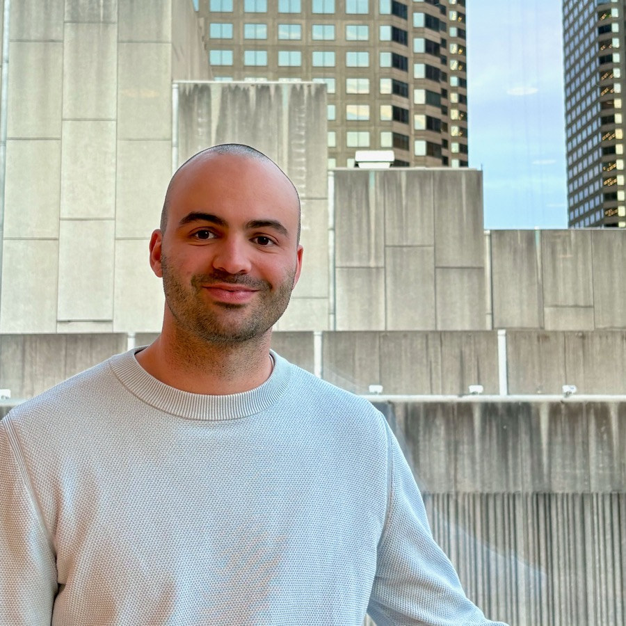

::: {.hero-shell}

Pascal Jutras-Dubé

::: {.hero-intro}
::: {.hero-intro__media}

:::

::: {.hero-intro__content}
::: {.cardish}
PhD student (Computer Science), Purdue University — advised by [Ruqi Zhang](https://ruqizhang.github.io){target="_blank" rel="noopener"}.
I work on sampling and generative modeling through learned stochastic processes.

Currently into

- Diffusion LLM foundations
- Parallel decoding & efficient sampling
- Test-time alignment / controllability

**Now seeking:** Fall 2026 research internship.
:::
:::
:::
:::

 

## Publications 
::: {#refs}
:::
